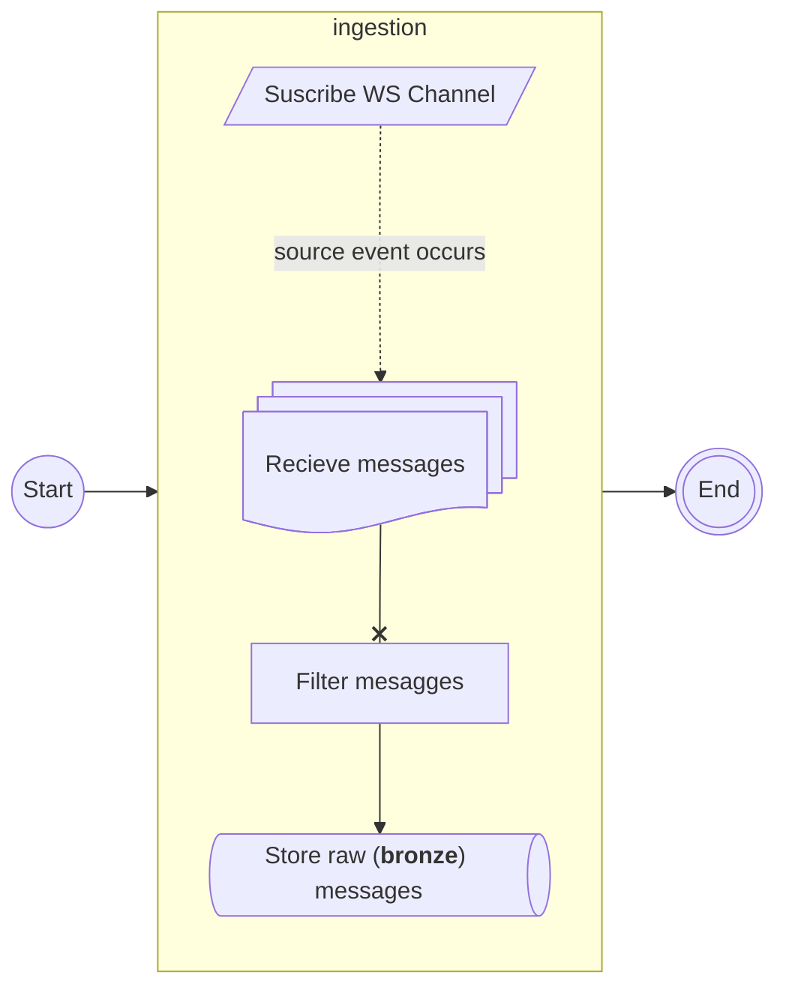

# Transport Events

```mermaid
---
title: 
---

flowchart LR
    main_start@{ shape: circle, label: "Start" }
    main_end@{ shape: dbl-circ, label: "End" }

    main_start --> ingestion
    subgraph ingestion
        ingestion_1@{ shape: lean-r, label: "Suscribe WS Channel" }
        ingestion_2@{ shape: docs, label: "Recieve messages" }
        ingestion_3@{ shape: rect, label: "Filter mesagges" }
        ingestion_4@{ shape: das, label: "Store raw (**bronze**) messages" }

        ingestion_1 -..->|source event occurs| ingestion_2
        ingestion_2 --x| | ingestion_3
        ingestion_3 --> ingestion_4
    end

    ingestion --> main_end
    
```
